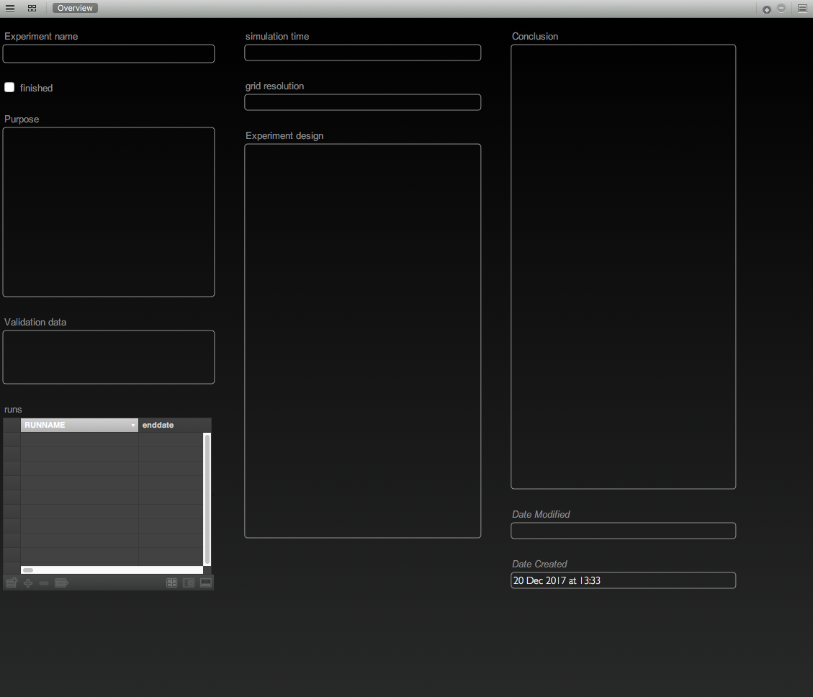
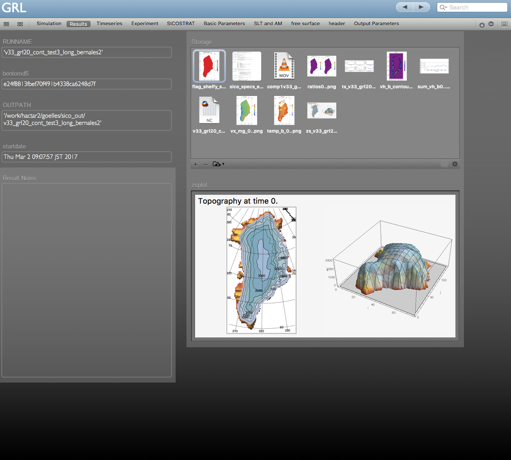
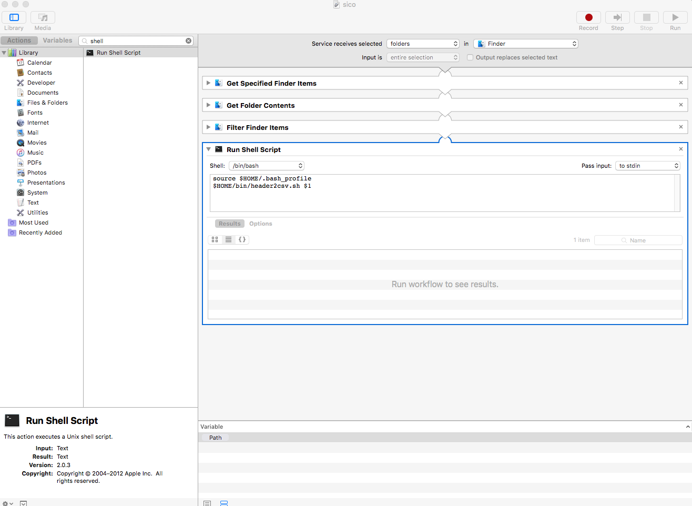

# SICOPOLIS_database

A tool to generate a database of experiment results of the open source ice sheet model SICOPOLIS (http://www.sicopolis.net).

**The database serves two purposes:**

1.) Long time storage of simulations; including setup and results.

2.) Better overview of simulations.

During development I quickly had several hundreds of simulation and it became hard to keep track of all the simulations. Therefore I developed the database to document and store my simulations.

This repository contains a bash script to convert SICOPOLIS header files into a comma-separated values (CSV) file and a database template.

## Database

I used the mac software Bento ([https://en.wikipedia.org/wiki/Bento_(database)](https://en.wikipedia.org/wiki/Bento_(database))) which unfortunately is not updated any more. Nevertheless, I included a database template (Experiments.bentoTemplate).

You can either use Bento and the template or your use your favourite database program and use my database setup as inspiration.

The database consists of two main tables, one for experiments and another one for the simulation setups and results. Here is a screenshot of the "Experiments" table, where you can design your experiments and write conclusions when they are finished.



In the second main table you add the model setup and store your results and plots. I included several sub-views for a better overview:




## Current state of development

This is the basic version of the database and I only changed a few things to make it more general. 
It has only been tested on my macbook but should work on Linux and might work under Windows with installed Bash as well.

For bug reports and other issues please use [github](https://github.com/tgoelles/SICOPOLIS_database/issues)  

### Future improvements

1.) Decide on an open source cross-platform database.

2.) Include subversion status and date again. I had this functionality, but it requires some changes in sico.sh

3.) There is currently no script to generate plots and add them automatically to the database. I have my own Mathematica script which produces plots and I drag and drop the plots into the database. 


## Installation

Please make sure that you have md5 and mktemp installed.

Copy the scripts to your script folder, for example $HOME/bin.

Here is a detailed manual:

1.) create a folder for the scripts 


```
mkdir $HOME/bin
```

2.) copy datagen.sh and nocomment.sh to the folder  $HOME/bin


```
cp datagen.sh $HOME/bin
cp nocomment.sh $HOME/bin
```

3.) 

Finally, add the following line to your .bash_profile or .bashrc 


```
export PATH="$HOME/bin:$PATH"
```
### Optional: Bento

Simply double click on the Experiments.bentoTemplate file to open the template in Bento. 

### Optional: Mac service

If you are using a mac you can generate a service with Automator:



Now you can right click on a folder with SICOPOLIS output and choose Services => your service.

This will generate a csv file from sico_specs.h on the desktop.

## Usage

The script header2cvs converts the SICOPOLIS headers to a semicolon separated CSV, which can then later be imported into a database or spreadsheet.

Go to a folder with SICOPOLIS output and type the command in the terminal:


```
header2csv.sh 
```

This generates a CSV file on the Desktop from the header "sico_specs.h". 

header2csv can also be used for other headers:
  
```
header2csv.sh sico_specs_v5_tibet_test.h
```

The default location for the csv file is the Desktop. Optionally you can give the location as the second argument. For example:

```
header2csv.sh sico_specs_v5_tibet_test.h ~/
```

## Workflow

1.) Start the SICOPOLIS simulation run as usual.

2.) Once finished, go to your output folder (e.g. sico_out) and type: $header2csv.sh or use the finder and the mac service (context menu) at the output folder.

3.) A csv with a unique name will appear on the Desktop. The name is generated with a unique md5 sum.
     
4.) Import the csv file into Bento or your database program, and make sure to use "semicolon" as the separator while importing.

5.) Fill out the "Simulation" form in Bento.

6.) Make plots and other analysis in your favourite program and copy them in a dedicated folder which you will keep forever. (Bento only saves the link to the files, not the file itself!)
     
7.) Drag the plots and any output you would like to keep into Results -> Storage
